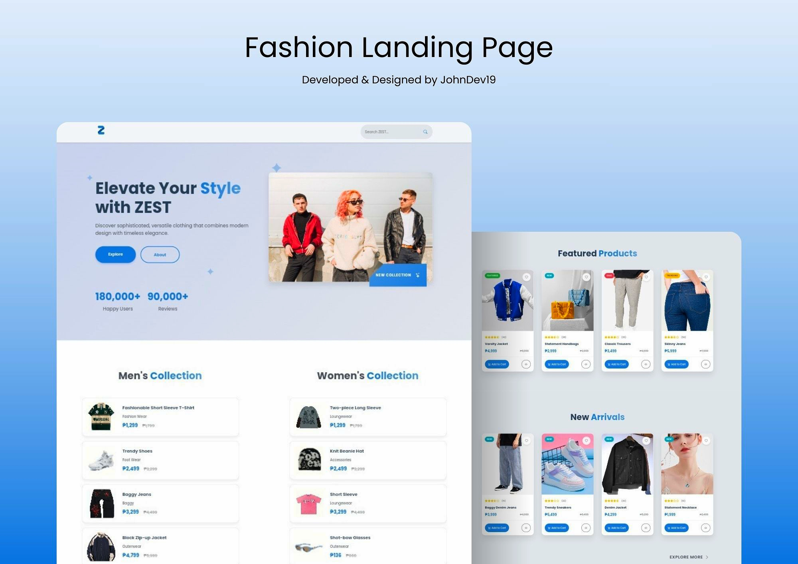
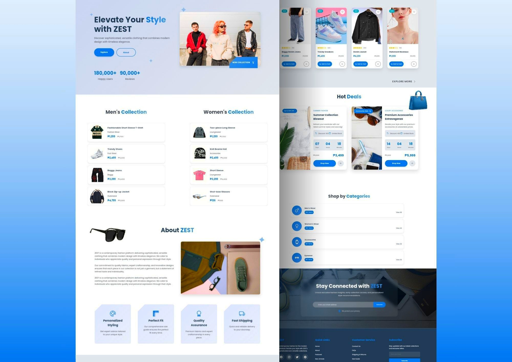

# 🌟 ZEST - Contemporary Fashion Platform

## 🚀 Project Overview

ZEST is a fully responsive e-commerce platform. ZEST offers a fashion marketplace.




## ✨ Key Features

### 🎨 Design & User Experience
- Responsive, mobile-first design
- Modern UI/UX
- Smooth, interactive animations
- Accessible design principles

### 🛍️ Product Capabilities
- Men's and women's collections
- Product showcases
- Wishlist and favorites functionality

### 🔍 Interactions
- Smooth scrolling
- Animated product transitions
- Hover states
- Countdown timers for deals
- Scroll-triggered animations

## 🛠 Technologies & Frameworks

### Frontend
- HTML5
- CSS3
- Vanilla JavaScript
- Responsive Design Principles

### Libraries & Tools
- AOS (Animate on Scroll)
- Bootstrap Icons
- Google Fonts

### Performance Optimization
- Lazy loading
- Minimal DOM manipulation
- Event handling
- Intersection Observer API

## 🌈 Color Palette

```css
:root {
    --primary-color: #f8f9fa;
    --secondary-color: #e9ecef;
    --accent-color: #2076c9;
    --text-color: #495057;
    --light-text-color: #ffffff;
}
```

## 🚦 Browser Compatibility
- Chrome (Latest)
- Firefox (Latest)
- Safari (Latest)
- Microsoft Edge
- Responsive across devices

## 📝 License
Distributed under the MIT License. See [LICENSE](LICENSE) for more information.

<div align="center"> <sub>Built with ❤️ by JohnDev19 | © 2024 ZEST Fashion Platform</sub> </div>
